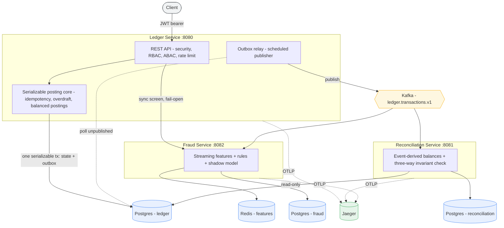
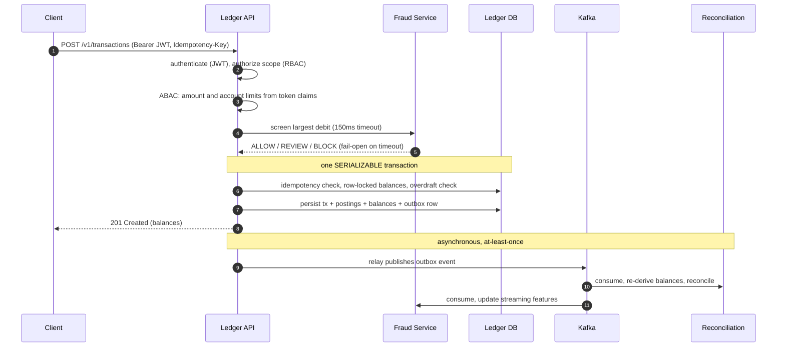

# Real-Time Payments Ledger with Fraud Detection

A correctness-first, double-entry payments ledger with a real-time event pipeline,
independent reconciliation, streaming fraud detection, security, and full
observability. Built as a study in distributed-systems correctness: every design
choice favors provable money-movement guarantees over convenience.

Java 21 · Spring Boot 3.4 · PostgreSQL · Kafka (KRaft) · Redis · OpenTelemetry / Jaeger · Docker Compose

---

## Why this project is different

Most payments take-home projects stop at "insert a row and return 200." This one
is built around the failure modes that make money systems hard, and it
demonstrates three things that are genuinely uncommon in a portfolio:

- **An independent reconciliation engine.** A separate service re-derives every
  account balance from the event stream alone and cross-checks it against the
  ledger's authoritative balances and against the sum of each account's postings.
  Three independent derivations that must agree. If the ledger, the outbox relay,
  or a consumer ever has a bug, it surfaces as measurable drift instead of silent
  corruption.
- **A shadow-mode fraud model.** Screening combines deterministic rules with a
  logistic-regression model that, by default, runs and is logged on every
  decision but does not enforce. This is how you safely ship a model into a money
  path: you watch it agree or disagree with reality before you ever give it
  authority.
- **A deliberate CP / AP boundary.** The ledger is correctness-first
  (serializable, consistent). The fraud service is availability-first. The ledger
  consults fraud inline but fails open on timeout, so a fraud outage never blocks
  money movement. The consistency tradeoff is chosen on purpose, not by accident.

Underpinning all of it: serializable double-entry posting with a balanced-postings
database invariant, exactly-once money movement via client idempotency keys, and a
transactional outbox so the event log can never disagree with the ledger.

---

## Architecture



Each service owns its own database and never writes another's. Cross-context
communication is by event or by API, never by shared tables. Reconciliation reads
the ledger database read-only (a read replica in production), which is the one
sanctioned exception, because reconciliation's whole job is to independently audit
the ledger.

## How a transaction flows



The fraud screen happens before the serializable transaction opens, so an external
call never holds database locks. The rules can block synchronously; the model, in
shadow mode, only records what it would have done.

---

## Services

| Service | Port | Data stores | Responsibility |
|---|---|---|---|
| ledger-service | 8080 | Postgres `ledger` | Authoritative double-entry ledger. Accounts, balances, serializable posting, idempotency, outbox. |
| reconciliation-service | 8081 | Postgres `reconciliation`, read-only Postgres `ledger` | Independently re-derives balances from events and detects drift. |
| fraud-service | 8082 | Redis, Postgres `fraud` | Streaming features, rules-plus-model screening, shadow-mode decision log. |

Supporting infrastructure (Docker Compose): PostgreSQL (three databases), Kafka in
KRaft mode, Redis, and Jaeger for traces.

## API

| Method and path | Service | Required scope | Notes |
|---|---|---|---|
| `POST /v1/accounts` | ledger | `ledger:write` | Open an account. |
| `GET /v1/accounts/{id}/balance` | ledger | `ledger:read` | Read a balance. |
| `POST /v1/transactions` | ledger | `ledger:write` | Post a balanced transaction. Requires `Idempotency-Key`. Also subject to ABAC and fraud screening. |
| `GET /v1/reconciliation/latest` | reconciliation | `recon:read` | Latest reconciliation report. |
| `POST /v1/reconciliation/run` | reconciliation | `recon:read` | Run a reconciliation pass on demand. |
| `POST /v1/fraud/evaluate` | fraud | `fraud:evaluate` | Screen a proposed transaction. |

Errors use a consistent shape with a `code` (for example `INSUFFICIENT_FUNDS` 422,
`IDEMPOTENCY_CONFLICT` 409, `ABAC_DENIED` 403, `FRAUD_BLOCKED` 403,
`RATE_LIMITED` 429).

---

## Quick start

Requires Docker. No host JDK or Maven is needed; the services build inside
containers.

```bash
git clone <this-repo> payments-ledger && cd payments-ledger
docker compose up --build -d
```

This starts Postgres (with the `ledger`, `reconciliation`, and `fraud`
databases), Kafka, Redis, Jaeger, and the three services. Security is on by
default, so requests need a JWT. Mint dev tokens with the included helper:

```bash
export JWT_SECRET=dev-secret-please-change-32bytes-minimum-0123456789
TOKEN=$(bash ./mint-token.sh "ledger:read ledger:write")

# open an account
curl -s -X POST localhost:8080/v1/accounts \
  -H "Authorization: Bearer $TOKEN" -H 'Content-Type: application/json' \
  -d '{"currency":"USD","allowOverdraft":true}'
```

To run the earlier smoke tests without tokens, start with `SECURITY_ENABLED=false
docker compose up -d`.

Observability endpoints once running: Jaeger UI on `:16686`, and
`/actuator/prometheus` on each service.

---

## Design decisions

- **Serializable isolation for money movement.** Every posting runs in one
  SERIALIZABLE transaction with automatic retry on serialization conflicts.
  Correctness first; throughput is scaled later by account-homed sharding, not by
  weakening isolation.
- **Balanced postings enforced by the database.** A deferred constraint trigger
  verifies that the signed postings of every transaction sum to zero, so money is
  conserved even if application code is wrong.
- **Exactly-once money movement.** Client idempotency keys plus a request
  fingerprint: the same key with the same request replays the original result; the
  same key with a different request is a conflict.
- **Transactional outbox over dual-write.** The event is written in the same
  transaction as the state change, then a polling relay publishes it. Delivery is
  at-least-once; consumers deduplicate by event id for exactly-once effect. This
  makes it impossible for the ledger and the event log to disagree.
- **Reconciliation as an independent auditor.** It trusts nothing: it rebuilds
  state from events and compares three independent derivations. Drift is a metric
  and an alarm, not a surprise.
- **Fraud model in shadow mode.** The serving path is real; the model is scored
  and logged but does not enforce until explicitly activated by config.
- **CP ledger, AP fraud, fail-open seam.** The ledger's availability never depends
  on the fraud service.
- **Security as scopes plus attributes.** RBAC from token scopes decides who may
  call what; ABAC from token claims (a per-token amount ceiling and an account
  allowlist) decides whether a specific transaction may proceed.

Deeper notes live in `docs/` (`phase2-events.md` for the event contract and
reconciliation semantics; `phase4b-observability.md` for tracing, logs, and
metrics).

---

## Verification approach

Correctness is verified at three levels:

- **Framework-free cores, compiled and run offline.** The correctness-critical
  logic (double-entry invariants, idempotency, the outbox relay coordination, the
  reconciliation three-way check, the fraud rules and model and shadow-mode
  combiner, the ABAC policy, and the token-bucket limiter) is written free of
  framework dependencies and exercised by standalone harnesses, independent of
  Spring, a database, or a broker.
- **Integration tests with Testcontainers.** The ledger's serializable posting and
  the balanced-postings trigger run against a real PostgreSQL.
- **End-to-end smoke tests.** Per-phase scripts drive the running stack over HTTP
  and assert observable behavior (balances, idempotent replay, reconciliation
  drift detection, fraud blocking and fail-open, auth and rate limiting, and
  telemetry).

---

## Project phases

Built incrementally as deep vertical slices, each committed and tagged.

| Phase | Tag | Adds |
|---|---|---|
| 1 | `v0.1.0-phase1` | Double-entry ledger core: serializable posting, idempotency, overdraft, outbox. |
| 2 | `v0.2.0-phase2` | Transactional outbox relay to Kafka and the independent reconciliation service. |
| 3 | `v0.3.0-phase3` | Real-time fraud: streaming features in Redis, rules plus a shadow-mode model, and the fail-open ledger gate. |
| 4a | `v0.4.0-phase4a` | Security: OAuth2 resource server, RBAC by scope, ABAC by claim, rate limiting, service-to-service auth. |
| 4b | `v0.4.1-phase4b` | Observability: distributed tracing to Jaeger, structured JSON logs with trace ids, and metrics. |

---

## Repository layout

```
ledger-service/           Authoritative double-entry ledger (Spring Boot)
reconciliation-service/   Independent event-derived reconciliation
fraud-service/            Streaming fraud detection
infra/postgres-init/      Creates the reconciliation and fraud databases
docs/                     Event contract, observability, local development notes
docker-compose.yml        Full local stack
mint-token.sh             Dev JWT minter for the secured APIs
```

Each service follows a clean, hexagonal layout: `domain` (pure business types),
`application` (use cases and ports), `infrastructure` (JDBC, Kafka, Redis, config
adapters), and `presentation` (REST). Money is integer minor units throughout;
there is no floating point in the money path.

---

## Scope and non-goals

Stated plainly, because knowing the boundaries is part of the design:

- The fraud model's weights are illustrative, not trained. The scoring and serving
  path is real; production loads trained weights.
- Local security uses HS256 with a shared dev secret. Production validates RS256
  against a JWKS endpoint from a real identity provider; that is a configuration
  change, not a code change.
- The synchronous request path (ledger to fraud) is one linked trace and the
  asynchronous event path (relay to consumers) is another. Joining them across the
  transactional outbox would require carrying trace context in the outbox row.
- Kafka, PostgreSQL, and Redis run single-node for local development. Production
  uses managed, replicated equivalents.
- The system is single-region. The scaling path is account-homed regional
  sharding with active-passive failover, because a serializable ledger cannot be
  trivially active-active.
